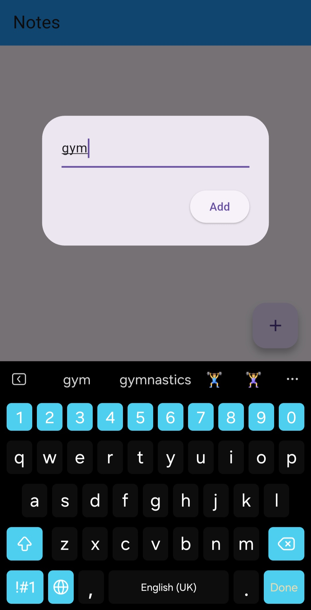

__Firebase_CRUD__

A simple application demonstrating Create, Read, Update, and Delete (CRUD) operations using Firebase Realtime Database.

__Features__
 
- Create: Add new records to the database

- Read: Retrieve and display all records

- Update: Modify existing records

- Delete: Remove records from the database

- Real-time Updates: Data automatically updates across the app when changes occur

 

  
__Setup__

Run the following commands from your terminal:

1. `https://github.com/54R07/firebase-crud` to clone this repository

2. `flutter pub get` in the project root directory to install all the required dependencies.

__Screenshots__

 
  
  
  
  
  
  

 
  
 
  
  
  
  

